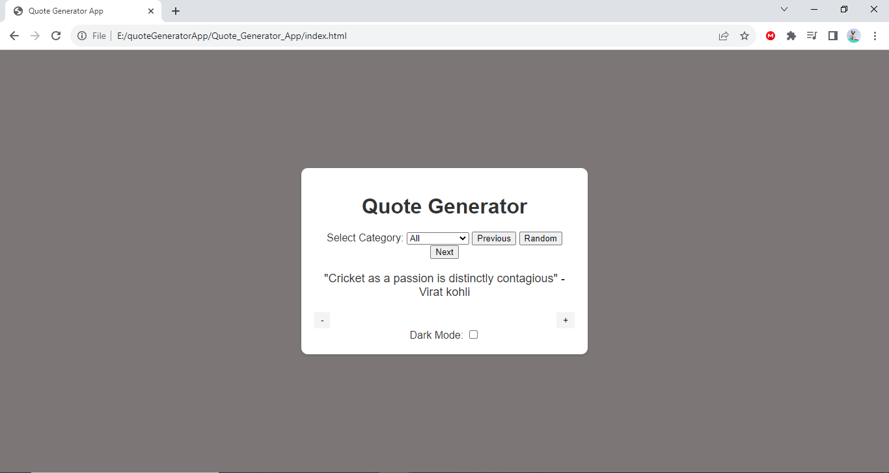

# Quote_Generator_App

This is a simple quote generator app that displays or gnerates quotes when the button is clicked. The app is built using HTML, CSS, and JavaScript without using any external framework.



## Features

- Click the "Random" button to display a random quote.
- Click the "Next" button to generate next quote and "Previous" button to generate previous quote according to the Category.
- Quotes are fetched from a predefined list and displayed dynamically.

## Technologies Used

- HTML
- CSS
- JavaScript

## Getting Started

1. Clone this repository to your local machine:

   ```bash
   git clone https://github.com/ankitmaharjan/Quote_Generator_App
